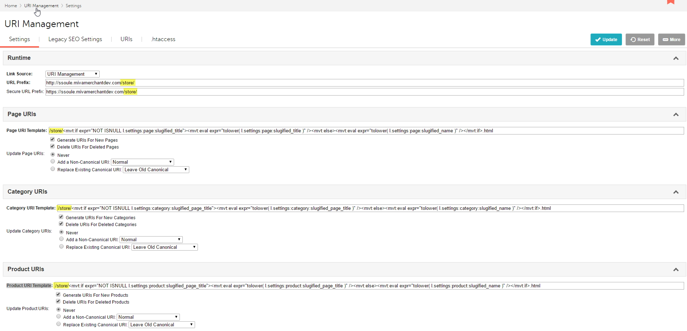

## Miva & WordPress Hybrids
# WordPress is Primary

## About

The file structure above is used to demonstrate how Miva & WordPress can be installed at a site's web root. Miva's URI management and WordPresses Permalinks can be coordinated to work on the same domain.

It just requires updating the `.htacces` file, and updating Miva's URI Management configuration.

## Updates

This process essentially works by forcing all traffic to WordPress's index.php, *unless*:

* It is an actual file on the server (.css, .js, .jpg, .xml, etc.)
* The URI starts with "store" (The "sub-directory" we'll use to seperate Miva from WordPress URLs)
* The URI starts with "mm5" (mm5/merchant.mvc, mm5/admin.mvc, mm5/json.mvc, etc.)


### Miva URI Management

1. In the Miva Admin, go to the URI Management > Settings tab.
2. Change the "URL Prefix", "Secure URL Prefix", "Page URI Template", "Category URI Template", and "Product URI Template" to include the "sub-directory" that you have chosen, and click Update.

3. In the Miva Admin, go to the URI Management > URIs tab, and Generate URIs for all Screens, Pages, Categories, and Products.

### .htaccess

Update the existing Miva & Wordpress rule sets to work like this:

```
### Begin - (Custom) Miva Merchant URI Management
RewriteEngine on
RewriteCond %{REQUEST_FILENAME} !-s
RewriteCond %{REQUEST_URI} ^/store/.*$
RewriteCond %{REQUEST_URI} !^/mm5/.*$
RewriteRule ^(.*)$ /mm5/uri.mvc? [QSA,L]
### End - (Custom) Miva Merchant URI Management


# BEGIN (Custom) WordPress
<IfModule mod_rewrite.c>
RewriteEngine On
RewriteRule ^index\.php$ - [L]
RewriteCond %{REQUEST_FILENAME} !-f
RewriteCond %{REQUEST_FILENAME} !-d
RewriteRule . /index.php [L]
</IfModule>
# END (Custom) WordPress
```